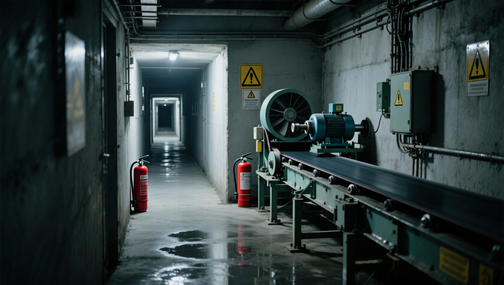
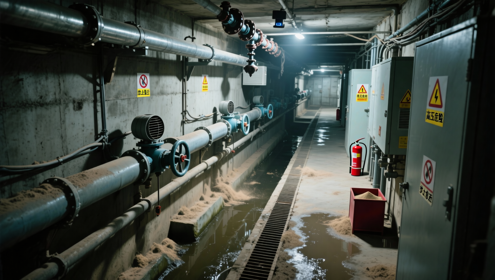
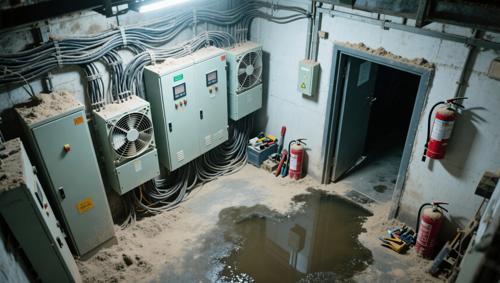
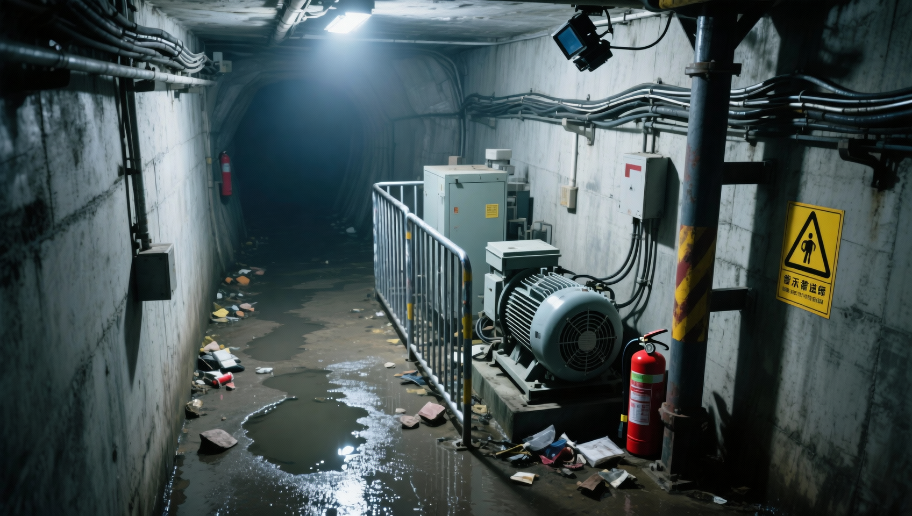
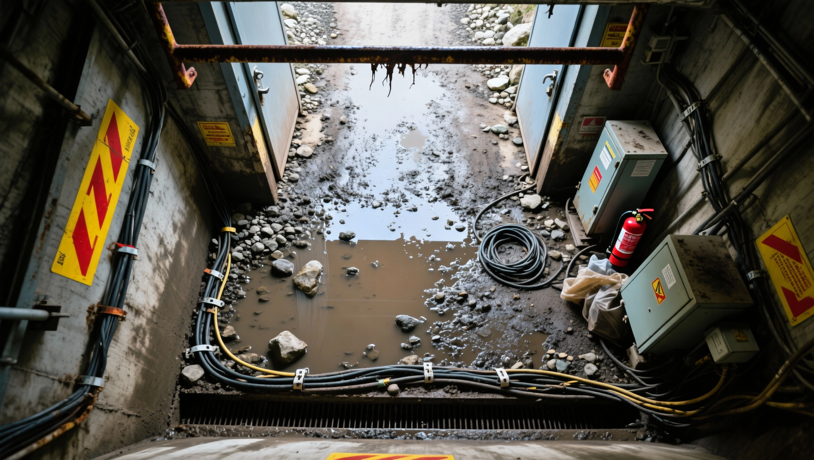

<div align="center">

# UMSBench-v1: A Real-Synthetic Composited Multimodal Benchmark Dataset for Underground Mine Safety

[](https://creativecommons.org/licenses/by-nc/4.0/)
[](#-dataset-download)
[](#)
<!-- [](#) -->

**Feiteng Han**<sup>1*</sup> &nbsp; **Ming Xue**<sup>2*</sup> &nbsp; **Kaiyu Li**<sup>1</sup> &nbsp; **Tao Feng**<sup>2</sup> &nbsp; **Wei Shen**<sup>1</sup> <br>
**Hui Wang**<sup>1</sup> &nbsp; **Yudong Fang**<sup>2†</sup> &nbsp; **Yu Wang**<sup>1†</sup> &nbsp; **Xuecheng Tan**<sup>3</sup>

<sup>1</sup>*School of Information Technology, Beijing City University* <sup>2</sup>*Big Data Center, Ministry of Emergency Management* <sup>3</sup>*School of Software, Tsinghua University*

<sup>†</sup> Corresponding author &nbsp;&nbsp; <sup>*</sup> Equal contribution

`{hanfeiteng, kaiyuli, shen_0711, bcuwhui, wangyu}@bcu.edu.cn` <br>
`research.xue@gmail.com` | `ifengtaoi@outlook.com` <br>
`fangyudong9713@ustc.edu` | `tanxuecheng@tsinghua.edu.cn`

</div>

<a id="news"></a>

## 🔥 News
* **[2026-04-07]** 📝 Our paper "UMSBench-v1" has been submitted to **ACM Multimedia (ACM MM) 2026** and is currently under review!

---

<a id="highlights"></a>
## ✨ Highlights

| Features | Description |
| :--- | :--- |
| 🔄 **Real-Synthetic Composited** | The **first** multimodal VQA benchmark dataset specifically designed for underground mining safety, comprising **10k** real-synthetic images. |
| 🛠️ **Novel I2T2I Mechanism** | Utilizes an innovative **Image-to-Text-to-Image** pipeline driven by LLM captioning and prompting engineering to overcome the scarcity of sensitive underground safety data. |
| 📊 **Comprehensive Scenarios** | Contains **40k** question-answer pairs covering 4 core dimensions: safety reasoning, captioning, understanding, and perception across **30+** site types. |
| ⚡ **Efficient Benchmarking** | Tasks are reformulated as **Single-Choice Questions (SCQs)**, enabling flexible, highly scalable, and efficient evaluation for state-of-the-art Vision-Language Models. |

---

## 📖 Abstract
To fill the gap in benchmark datasets for vision-language models (VLM) research on underground mining safety analysis, we introduce **UMSBench-v1.0**. As the first multimodal VQA benchmark dataset and the first real-synthetic image dataset on mining safety, it consists of **10k real-synthetic underground images** and **40k question-answer pairs**, covering safety reasoning, captioning, understanding, and perception across 30 underground mining site types. 

The synthetic data is generated via a newly proposed **Image-to-Text-to-Image (I2T2I)** mechanism based on refined LLM-driven captioning capabilities, prompt engineering, and visual content generation models. Furthermore, benchmarking tasks are reformulated as Single-Choice Questions (SCQs) to achieve higher flexibility, scalability, and efficiency. State-of-the-art VLMs are benchmarked and fine-tuned to demonstrate the dataset’s effectiveness and potential applications. The dataset is officially released at [BCU-AILAB/UMSBench](https://github.com/BCU-AILAB/UMSBench).

---

## 🖼️ Dataset Overview & I2T2I Examples

Our dataset utilizes the proposed **I2T2I** pipeline to generate high-fidelity synthetic images that closely match the semantic distribution of real underground mining scenarios. Below are some examples of the generated images paired with their corresponding textual prompts.

| Synthetic Image | Generation Prompt|
| :---: | :--- |
|  | **Prompt:** *Intersection (long-range camera at the end of the corridor facing the passage and equipment side, inner side of the corner): the frame covers the inner corner area and adjacent equipment zones, where a fire extinguisher, belt conveyor, motor, and warning sign are visible; the scene is accompanied by insufficient lighting and similar conditions; the belt conveyor is close to a poorly lit area, where the dim floor lighting creates irregular reflections; the fan is also near a poorly lit area, where the dim floor lighting creates irregular reflections. Attention should be paid to passage clearance and sign visibility, equipment guarding and line fixation with moisture protection, and the placement and accessibility of firefighting equipment, so as to prevent mechanical injury risks from rotating parts and risks of accidental entry and collision caused by poor visibility, ensuring safe production. Underground surveillance image, fixed camera position, real security-monitoring perspective, no text, no watermark.* |
|  | **Prompt:** *Underground substation (high-mounted fixed corner camera overlooking the passage, beside the cable trench): the frame covers the area beside the cable trench and adjacent equipment zones, where warning signs, pipes, a fan, and valves are visible; the scene is accompanied by dust, water stains, and similar conditions; overhead valves span across the walkway, with some hanging down close to the damp floor. Attention should be paid to passage clearance and sign visibility, equipment guarding and line fixation with moisture protection, and the placement and accessibility of firefighting equipment, so as to prevent fire risks caused by dust accumulation and friction, as well as blocked passage, tripping, and collision risks, ensuring safe production. Underground surveillance image, fixed camera position, real security-monitoring perspective, no text, no watermark.* |
|  | **Prompt:** *Underground power distribution room (high-mounted fixed corner camera overlooking the passage, corner maintenance area): the frame covers the corner maintenance area and adjacent equipment zones, where a control cabinet, fan, electrical cabinet, and cables are visible; the scene is accompanied by standing water, dust, and stacked items; the fire extinguisher is located at the edge of the doorway area, but access is partially blocked by surrounding dust. Attention should be paid to passage clearance and sign visibility, equipment guarding and line fixation with moisture protection, and the placement and accessibility of firefighting equipment, so as to prevent electric shock, short circuits, and electrical fire risks, slipping and electrical moisture exposure caused by wet standing water, and fire risks caused by dust accumulation and friction, ensuring safe production. Underground surveillance image, fixed camera position, real security-monitoring perspective, no text, no watermark.* |
|  | **Prompt:** *Roadway/work area (high-mounted sidewall camera looking obliquely downward over the equipment area, beside the equipment): the frame covers the area beside the equipment and adjacent equipment zones, where a motor, guardrails, debris, and warning signs are visible; the scene is accompanied by reflections, dampness, and dim lighting; warning signs are placed beside the columns, but their visibility is affected by the darkness. Attention should be paid to passage clearance and sign visibility, equipment guarding and line fixation with moisture protection, and the placement and accessibility of firefighting equipment, so as to prevent slipping and electrical moisture exposure caused by damp standing water, blocked passage, tripping and collision risks, and accidental entry and collision caused by poor visibility, ensuring safe production. Underground surveillance image, fixed camera position, real security-monitoring perspective, no text, no watermark.* |
|  | **Prompt:** *Inclined roadway (ceiling-mounted fixed camera looking downward over the work area, beside the handrail guardrail): the frame covers the area beside the handrail guardrail and adjacent equipment zones, where warning signs, cables, gravel, and guardrails are visible; the scene is accompanied by muddy water, reflections, clutter, and similar conditions; overhead guardrails span across the doorway area, with some hanging down near the cable trench. Attention should be paid to passage clearance and sign visibility, equipment guarding and line fixation with moisture protection, and the placement and accessibility of firefighting equipment, so as to prevent electric shock, short circuits, and electrical fire risks, fire risks caused by dust accumulation and friction, and accidental entry and collision caused by poor visibility, ensuring safe production. Underground surveillance image, fixed camera position, real security-monitoring perspective, no text, no watermark.* |
> **Note for Users:** The above prompts are representative examples used during the synthesis phase. The full dataset includes diverse prompts covering 30+ site types.

---

## 📥 Dataset Download

### 1. Samples Subset (Publicly Available)
The data provided via the links below represents a **samples subset** of the complete dataset, intended for demonstration and initial exploration purposes. This subset contains two folders: `synthetic` and `real`.

* ☁️ **[Baidu Drive](https://pan.baidu.com/s/1g9zy5I0nT8RO64LsfrRpeQ?)**
* ☁️ **[Google Drive](https://drive.google.com/file/d/119AdLDWoQUtZY1LqiRR_SdxiJsRWRPjM/view?usp=sharing)**

### 2. Full Dataset Access Agreement
Due to the domain-specific and sensitive nature of underground mining safety data, the full **UMSBench-v1.0** dataset is available strictly for **non-commercial, academic research purposes**. To access the full dataset, please follow these steps:

1. Download the [Dataset Access Agreement Form (PDF)](#) *(TODO: Insert the link to your agreement PDF here)*.
2. Carefully read the terms. The form must be completely filled out and **hand-signed by a full-time faculty member or legal representative** (e.g., Professor, PI, or Lab Director) of your institution.
3. Send the scanned, signed copy of the agreement using your **official institutional email address** to: 
   📧 `hanfeiteng@bcu.edu.cn` and `wangyu@bcu.edu.cn`.
   * **Email Subject Format:** `[UMSBench Full Dataset Application] - {Your Institution} - {Your Name}`
4. Upon approval (usually within 3-5 business days), we will reply with the download links and decryption passwords for the full dataset.

> **⚠️ Important:** Applications sent from personal email addresses (e.g., @gmail.com, @qq.com, @163.com) or lacking a proper authorized signature will **NOT** be processed.

---

## 🙏 Acknowledgments
This work was supported by the **National Key Research and Development Program of China** (2024YFC3015605, 2024YFC3015505). 

We appreciate Xihong Lin, Yijie Li, Runquan Shen, Zimeng Xin, Boyu Gao, Xinze He, Zitong Hui, Tianfei Xin, and Yuyan Wang at BCU for their hard work in data processing. We also appreciate the authors of previous SOTA works for their open-source codes, models, and datasets, and the anonymous reviewers for their helpful feedback.

---

## 📝 Citation
If you find our dataset or paper useful in your research, please consider citing our work:

```bibtex
@inproceedings{han2024umsbench,
  title={UMSBench-v1: A Real-Synthetic Composited Multimodal Benchmark Dataset for Underground Mine Safety},
  author={Han, Feiteng and Xue, Ming and Li, Kaiyu and Feng, Tao and Shen, Wei and Wang, Hui and Fang, Yudong and Wang, Yu and Tan, Xuecheng},
  booktitle={Under Review}, 
  year={2024}
}
